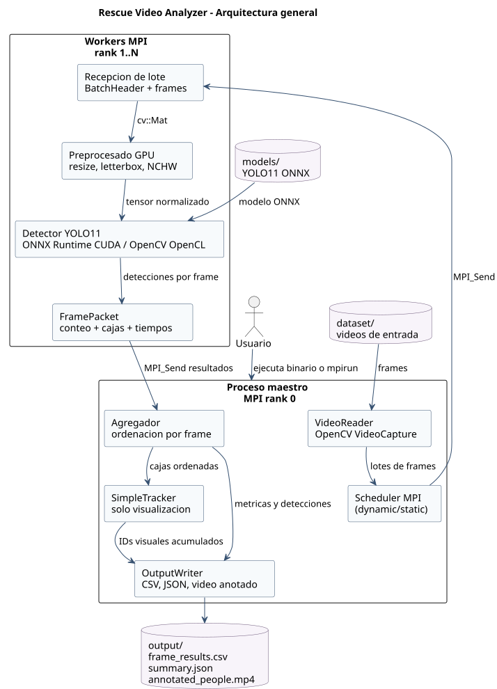
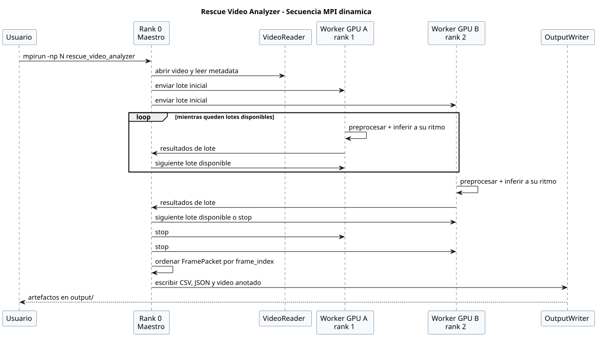
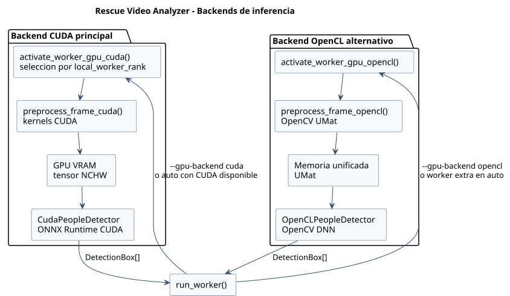
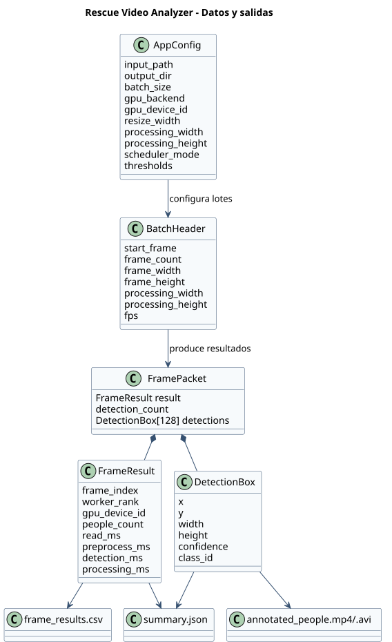
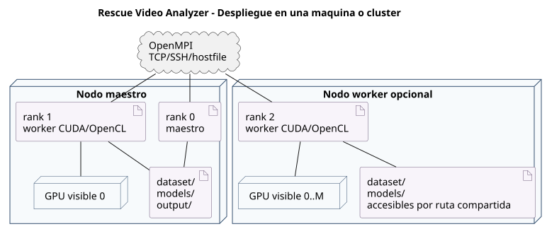

# Rescue Video Analyzer

Analizador distribuido de video para detectar, contar y seguir personas por frame
usando modelos YOLO11 en formato ONNX. El proyecto combina paralelismo con MPI,
preprocesado acelerado por GPU y dos backends de inferencia: CUDA y OpenCL.

Esta pensado para escenarios de vigilancia, rescate o analisis de video donde
interesa procesar secuencias largas de forma reproducible y comparar el impacto
del reparto de trabajo entre varios procesos o nodos.

## Caracteristicas

- Deteccion de personas con YOLO11 exportado a ONNX.
- Arquitectura maestro/trabajador sobre MPI.
- Scheduler dinamico para balancear carga entre GPUs con distinto rendimiento.
- Schedulers estaticos para comparar estrategias de reparto.
- Backend CUDA con ONNX Runtime y preprocesado en kernels CUDA.
- Backend OpenCL con OpenCV DNN como alternativa portable.
- Generacion de CSV por frame, resumen JSON y video anotado.
- Scripts para benchmarks locales y lanzamiento en cluster MPI.
- Diagramas PlantUML incluidos en `docs/diagrams/`.

## Tabla de contenidos

- [Arquitectura](#arquitectura)
- [Estructura del repositorio](#estructura-del-repositorio)
- [Requisitos](#requisitos)
- [Instalacion](#instalacion)
- [Compilacion](#compilacion)
- [Uso rapido](#uso-rapido)
- [Opciones de ejecucion](#opciones-de-ejecucion)
- [Modelos ONNX](#modelos-onnx)
- [Salidas generadas](#salidas-generadas)
- [Benchmarks](#benchmarks)
- [Ejecucion en cluster](#ejecucion-en-cluster)
- [Diagramas](#diagramas)
- [Troubleshooting](#troubleshooting)

## Arquitectura

El ejecutable `rescue_video_analyzer` usa un modelo SPMD: todos los procesos
ejecutan el mismo binario, pero el rank `0` actua como maestro y el resto de
ranks como trabajadores.



Flujo principal:

1. El maestro abre el video de entrada y agrupa frames en lotes.
2. Los lotes se envian a workers mediante MPI.
3. Cada worker preprocesa frames, ejecuta inferencia y devuelve detecciones.
4. El maestro ordena resultados por `frame_index`.
5. El maestro calcula metricas, aplica tracking para visualizacion y escribe las
   salidas.

El scheduler recomendado es `dynamic`, porque entrega el siguiente lote al
worker que queda libre primero. Esto suele funcionar mejor en entornos
heterogeneos, donde no todas las GPUs o nodos tienen el mismo rendimiento.



Schedulers disponibles:

| Scheduler | Descripcion |
| --- | --- |
| `dynamic` | Asigna nuevos lotes a medida que cada worker termina. |
| `static-contiguous` | Divide el video en bloques contiguos por worker. |
| `static-round-robin` | Reparte lotes por turnos entre workers. |

### Backends GPU



Backend CUDA:

- Preprocesado en `src/gpu_preprocess.cu`.
- Letterbox, normalizacion y layout `NCHW` en GPU.
- Inferencia mediante ONNX Runtime CUDA.
- Carga dinamica de `libonnxruntime`.

Backend OpenCL:

- Preprocesado con OpenCV `UMat`.
- Inferencia con OpenCV DNN y target OpenCL.
- Puede caer a CPU si OpenCV no tiene OpenCL disponible.

## Estructura del repositorio

```text
.
|-- CMakeLists.txt
|-- README.md
|-- dataset/                 # Videos de ejemplo
|-- docs/
|   |-- diagrams/            # Diagramas PlantUML y SVG
|   |-- memoria.pdf
|   `-- memoria.tex
|-- include/rescue/          # Cabeceras publicas del proyecto
|-- models/                  # Modelos YOLO11 en formato ONNX
|-- scripts/
|   |-- benchmark_parallel.sh
|   `-- launch_cluster.py
`-- src/                     # Implementacion C++, CUDA y OpenCL
```

Los directorios `build/`, `output/`, `parallel_benchmarks/` y `.venv/` son
artefactos locales y no forman parte del codigo fuente.

## Requisitos

Requisitos base:

- CMake 3.24 o superior.
- Compilador C++17.
- OpenCV 4 con los modulos `core`, `imgproc`, `videoio`, `objdetect` y `dnn`.
- OpenMPI (`mpicxx`, `mpirun` o `mpiexec`).

Para CUDA:

- CUDA Toolkit con `nvcc`.
- Driver NVIDIA compatible.
- ONNX Runtime GPU disponible como libreria compartida.

Para OpenCL:

- OpenCV compilado con soporte OpenCL.
- Runtime OpenCL del dispositivo que se quiera usar.

Herramientas opcionales:

- Python 3 para los scripts de benchmark y lanzamiento en cluster.
- PlantUML y Java para regenerar diagramas.
- Graphviz si se quieren renderizar diagramas PlantUML que dependan de `dot`.

## Instalacion

En Ubuntu o WSL, una instalacion base puede hacerse con:

```bash
sudo apt-get update
sudo apt-get install -y \
  cmake \
  g++ \
  libopencv-dev \
  openmpi-bin \
  libopenmpi-dev \
  nvidia-cuda-toolkit \
  python3 \
  python3-venv
```

Si vas a usar el backend CUDA, instala ONNX Runtime GPU en un entorno virtual o
exporta la ruta de la libreria manualmente:

```bash
python3 -m venv .venv
source .venv/bin/activate
pip install onnxruntime-gpu
```

El binario busca `libonnxruntime` en rutas habituales dentro de `.venv/`. Si la
libreria esta en otro lugar, define:

```bash
export RESCUE_ORT_LIBRARY=/ruta/a/libonnxruntime.so
```

En WSL, si existe `/usr/lib/wsl/lib`, el programa la anade al entorno de
ejecucion para localizar las librerias del driver NVIDIA.

## Compilacion

Compilacion con CUDA habilitado:

```bash
cmake -S . -B build
cmake --build build -j
```

Compilacion sin CUDA, usando solo la ruta OpenCL/CPU:

```bash
cmake -S . -B build -DRESCUE_ENABLE_CUDA=OFF
cmake --build build -j
```

La arquitectura CUDA por defecto es `89`. Si tu GPU necesita otra arquitectura,
puedes indicarla durante la configuracion:

```bash
cmake -S . -B build -DCMAKE_CUDA_ARCHITECTURES=86
cmake --build build -j
```

## Uso rapido

Ejecutar en una maquina con una GPU NVIDIA usando un maestro y un worker:

```bash
mpirun -np 2 ./build/rescue_video_analyzer \
  --input dataset/videoset2.mp4 \
  --output-dir output \
  --batch-size 8 \
  --scheduler dynamic
```

Para benchmarks, normalmente interesa evitar la escritura del video anotado:

```bash
mpirun -np 2 ./build/rescue_video_analyzer \
  --input dataset/videoset2.mp4 \
  --output-dir output_bench \
  --batch-size 8 \
  --scheduler dynamic \
  --no-annotated-video
```

El ejecutable tambien puede relanzarse con `mpirun` automaticamente si se
invoca sin launcher MPI. En ejecuciones reproducibles o en cluster es preferible
usar `mpirun`/`mpiexec` de forma explicita.

## Opciones de ejecucion

```text
--input <video>                         video de entrada, obligatorio
--output-dir <dir>                      directorio de salida, por defecto output
--batch-size <N>                        frames por lote MPI
--processing-width <px>                 ancho de procesamiento, 0 para nativo
--processing-height <px>                alto de procesamiento, 0 para nativo
--gpu-device auto|<id>                  seleccion de GPU visible
--gpu-backend auto|cuda|opencl          backend de inferencia
--resize-width <px>                     tamano cuadrado de entrada YOLO
--edge-threshold <N>                    umbral auxiliar de bordes
--model <path>                          modelo ONNX
--score-threshold <0..1>                confianza minima
--nms-threshold <0..1>                  umbral de NMS
--top-k <N>                             maximo de candidatos antes de NMS
--scheduler dynamic|static-contiguous|static-round-robin
--no-annotated-video                    desactiva el video anotado
```

Aliases legacy aceptados:

```text
--yolo-model
--yolo-conf
--yolo-nms
--yolo-top-k
```

### Ejemplos utiles

Usar backend CUDA y seleccionar la GPU visible `0`:

```bash
mpirun -np 2 ./build/rescue_video_analyzer \
  --input dataset/videoset.mp4 \
  --output-dir output_gpu0 \
  --batch-size 8 \
  --gpu-backend cuda \
  --gpu-device 0
```

Usar resolucion nativa del video como resolucion de procesamiento:

```bash
mpirun -np 2 ./build/rescue_video_analyzer \
  --input dataset/videoset2.mp4 \
  --output-dir output_native \
  --processing-width 0 \
  --processing-height 0 \
  --batch-size 8
```

Ejecutar la ruta OpenCL:

```bash
mpirun -np 2 ./build/rescue_video_analyzer \
  --input dataset/videoset2.mp4 \
  --output-dir output_opencl \
  --gpu-backend opencl \
  --batch-size 8
```

## Modelos ONNX

El modelo por defecto es:

```text
models/yolo11s_1088.onnx
```

Modelos incluidos:

| Modelo | Resolucion recomendada | Comentario |
| --- | ---: | --- |
| `models/yolo11n.onnx` | `640` | Variante ligera. |
| `models/yolo11s.onnx` | `640` | Variante small legacy. |
| `models/yolo11s_960.onnx` | `960` | Mayor resolucion espacial. |
| `models/yolo11s_1088.onnx` | `1088` | Valor por defecto para flujo 1080p. |
| `models/yolo11m.onnx` | `640` | Variante mas pesada. |
| `models/yolo11l.onnx` | `640` | Variante grande. |

El valor de `--resize-width` debe coincidir con el tamano de exportacion del
modelo ONNX:

```bash
mpirun -np 2 ./build/rescue_video_analyzer \
  --input dataset/videoset2.mp4 \
  --model models/yolo11s_960.onnx \
  --resize-width 960 \
  --output-dir output_yolo11s_960 \
  --batch-size 8
```

## Salidas generadas



Cada ejecucion escribe sus resultados en `--output-dir`:

```text
output/
|-- frame_results.csv
|-- summary.json
`-- annotated_people.mp4
```

Si se usa `--no-annotated-video`, no se genera `annotated_people.mp4`.

Campos principales de `frame_results.csv`:

| Campo | Significado |
| --- | --- |
| `frame_index` | Indice del frame dentro del video. |
| `worker_rank` | Rank MPI que proceso el frame. |
| `gpu_device_id` | GPU visible usada por el worker. |
| `timestamp_ms` | Instante temporal del frame. |
| `people_count` | Numero de detecciones de persona. |
| `mean_intensity` | Intensidad media auxiliar del frame. |
| `edge_density` | Densidad de bordes auxiliar. |
| `read_ms` | Tiempo asociado a lectura/envio. |
| `preprocess_ms` | Tiempo de preprocesado. |
| `detection_ms` | Tiempo de inferencia. |
| `processing_ms` | Tiempo total de procesamiento del frame. |

`summary.json` incluye:

- Metadatos del video.
- Configuracion efectiva de la ejecucion.
- Promedios de tiempos por etapa.
- Estadisticas de deteccion.
- Balanceo de carga por worker.
- Tiempos globales de procesamiento y escritura.

## Benchmarks

El script `scripts/benchmark_parallel.sh` ejecuta varias combinaciones de
tamano de mundo MPI y scheduler:

```bash
MPI_WORLD_SIZES="2 3 4" \
SCHEDULERS="dynamic static-contiguous static-round-robin" \
./scripts/benchmark_parallel.sh dataset/videoset.mp4 parallel_benchmarks
```

El script imprime una tabla TSV por stdout y guarda cada ejecucion en:

```text
parallel_benchmarks/np<N>_<scheduler>/
```

Para comparar escalado multi-GPU de forma limpia, usa como regla:

```text
numero de procesos MPI = 1 maestro + numero de GPUs participantes
```

En una maquina con una unica GPU CUDA, `mpirun -np 2` es la configuracion
natural. Lanzar mas workers que GPUs reales puede introducir contencion o
mezclar rutas CUDA/OpenCL/CPU.

## Ejecucion en cluster

En cluster, `dataset/`, `models/` y el ejecutable deben existir en todos los
nodos o estar disponibles mediante un filesystem compartido.



Lanzamiento automatico con descubrimiento de GPUs:

```bash
./scripts/launch_cluster.py \
  --ips localhost,192.168.1.55 \
  --args "--input dataset/videoset2.mp4 --output-dir output_cluster --batch-size 8 --scheduler dynamic"
```

El script:

- Sondea cada nodo mediante SSH.
- Cuenta GPUs NVIDIA con `nvidia-smi`.
- Cuenta dispositivos OpenCL con `clinfo`, si esta disponible.
- Genera `hosts_cluster.txt`.
- Lanza `mpiexec` con un rank maestro y los workers detectados.

Lanzamiento manual con hostfile:

```bash
mpirun --hostfile hosts_cluster.txt -np 4 ./build/rescue_video_analyzer \
  --input dataset/videoset2.mp4 \
  --model models/yolo11s_1088.onnx \
  --output-dir output_cluster \
  --batch-size 8 \
  --scheduler dynamic
```

Requisitos practicos para cluster:

- SSH sin interaccion configurado para OpenMPI.
- Misma ruta del ejecutable en los nodos, o filesystem compartido.
- Rutas de `dataset/` y `models/` accesibles desde todos los nodos.
- Variables de entorno CUDA/ONNX Runtime resueltas en cada nodo.
